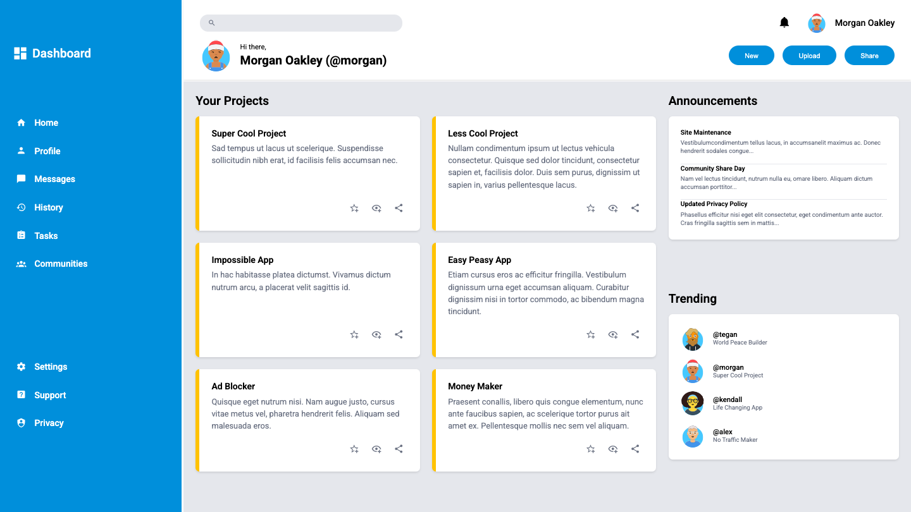

# Admin Dashboard

This project is a modern admin dashboard interface built with HTML and CSS. It demonstrates advanced layout techniques using CSS Grid and Flexbox to create a professional, responsive dashboard design.

## Live Demo/Screenshot

[Live Demo](https://malvin149.github.io/admin-dashboard/)



---

### ✨ Features

- **Grid-Based Layout:** Uses CSS Grid for a flexible two-column layout with sidebar and main content areas.
- **Sidebar Navigation:** Primary and secondary navigation sections with hover effects.
- **Project Cards:** Dynamic grid of project cards with action buttons (favorite, view, share).
- **Search Functionality:** Header search bar with icon integration.
- **User Profile Section:** Avatar display and user information in the header.
- **Announcements Panel:** Updates and notifications sidebar.
- **Trending Section:** Popular users and projects display.
- **Modern Icons:** Material Design Icons integration via CDN.

### 🚀 Technologies Used

- **HTML5:** For semantic web structure.
- **CSS3:** Advanced styling with Grid, Flexbox, and animations.
- **Google Fonts:** Roboto font family for clean typography.
- **Material Design Icons:** Comprehensive icon library.

### ⚙️ Setup and Usage

1. Getting this project up and running is straightforward:

```bash
git clone git@github.com:malvin149/admin-dashboard.git
cd admin-dashboard
```

2. **Open in Browser:** Simply open the `index.html` file in your preferred web browser. All styles are linked via `style.css`.

### 🤝 Credits and Attribution

- **Icons:** Material Design Icons from [Material Design Icons](https://materialdesignicons.com/).
- **Fonts:** Roboto font family from [Google Fonts](https://fonts.google.com/specimen/Roboto).
- **Avatar Images:** Random SVG avatars generated from [Avataaars Generator](https://getavataaars.com/).

